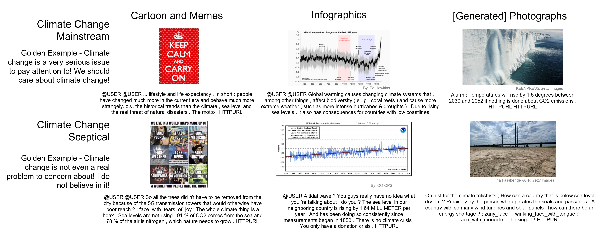
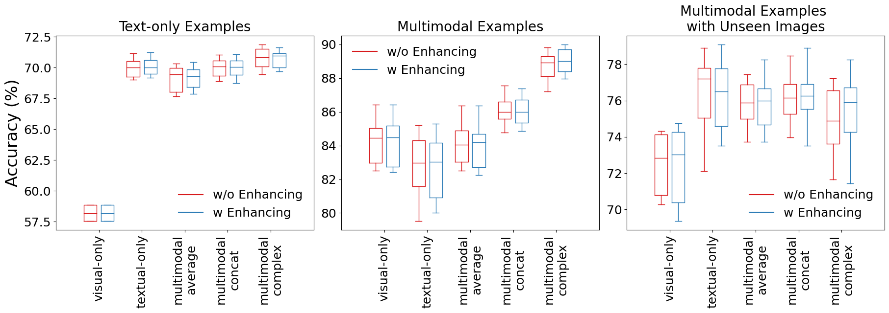
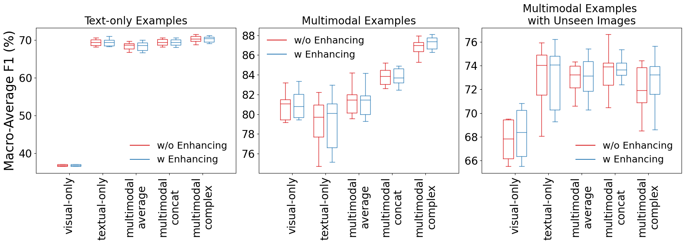
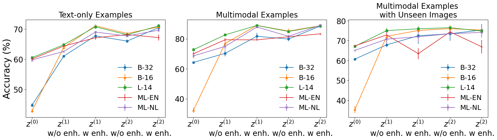
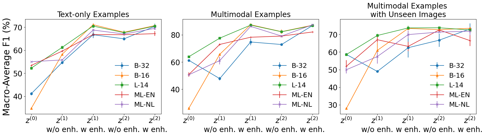
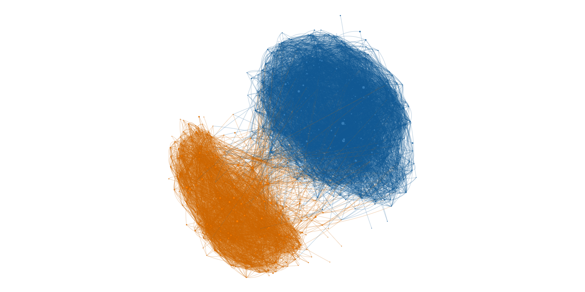

# Climate_Stance_Multimodal
This is the code for the Paper '*Inferring Climate Change Stances from Multimodal Tweets*' accepted by the Short Paper track of [SIGIR 2024](https://sigir-2024.github.io/index.html).

[](https://zenodo.org/doi/10.5281/zenodo.11093442)

## Cite as

Nan Bai, Ricardo da Silva Torres, Anna Fensel, Tamara Metze, and Art Dewulf. 2024. Inferring Climate Change Stances from Multimodal Tweets. In *Proceedings of the 47th International ACM SIGIR Conference on Research and Development in Information Retrieval (SIGIR ’24), July 14–18, 2024, Washington, DC, USA*. ACM, New York, NY, USA, 5 pages. [https://doi.org/10.1145/3626772.3657950](https://doi.org/10.1145/3626772.3657950)

```
@inproceedings{bai2024climate,
author = {Bai, Nan and da Silva Torres, Ricardo and Fensel, Anna and Metze, Tamara and Dewulf, Art},
title = {Inferring Climate Change Stances from Multimodal Tweets},
year = {2024},
isbn = {9798400704314},
publisher = {Association for Computing Machinery},
address = {New York, NY, USA},
url = {https://doi.org/10.1145/3626772.3657950},
doi = {10.1145/3626772.3657950},
pages = {},
numpages = {5},
keywords = {Multimodal Embeddings, Transfer Learning, User-Generated Content, Climate Change Claims, Sea-Level Rise, Public Policy},
location = {, Washington, DC, USA, },
series = {SIGIR '24}
}
```
or
```
@software{nan_bai_2024_11093443,
  author       = {Nan Bai},
  title        = {zzbn12345/Climate\_Stance\_Multimodal: Zenodo Update},
  month        = apr,
  year         = 2024,
  publisher    = {Zenodo},
  version      = {v1.0.1},
  doi          = {10.5281/zenodo.11093443},
  url          = {https://doi.org/10.5281/zenodo.11093443}
}
```

## Workflow and Dataset
This project provides a workflow to construct multimodal dataset about climate change stances from Twitter.
The workflow is illustrated as follows:


The datasets used in the paper is saved under ```./data``` folder.

For data security and privacy issues, we only share the processed, anonymized, and translated English tweets as the raw textual data and the image IDs as the visual data.
Further in-detail data can be provided upon request.

### Data

```./data/tweets_subset.csv``` is the main dataset used for training and evaluation, which is a non-redundant, unambiguous, and easy subset of the originally collected full dataset.
Here we show a few examples of our collected dataset:
| | id | skepticism | mainstream | label | text_NL | text_EN | split | available | target | unseen_images |
| ------ | ------ |------ |------ |------ |------ |------ |------ |------ |------ |------ |
| 2 | 909170801 | FALSE | TRUE | 1 | Nederland moet vaart maken met beveiliging tegen zeespiegelstijging HTTPURL | The Netherlands must speed up protection against sea level rise HTTPURL | val | FALSE | | -1 |
| 21584 | 1222041615092630000 | TRUE | FALSE | 2 | De dijken zijn berekend op een #zeespiegelstijging van 6 meter In het huidige tempo duurt dat nog zo'n 40.000 jaar ! ! #klimaathysterie HTTPURL HTTPURL | The dikes are designed for a sea level rise of 6 meters . At the current rate , that will take about 40,000 years ! ! #climatehysteria HTTPURL HTTPURL | test | TRUE | 3_1222041608851509249 | 0 |

```id``` is the original Tweet ID; ```skepticism``` marks if the example involves a user in the retweet chain typically clustered as someone who are sceptical about the existence or anthropogenic nature of climate change; ```mainstream``` marks if the example involves a user in the retweet chain typically clustered as someone who support the mainstream view on anthropogenic climate change issues; ```label``` marks the stance label for this multimodal example, where 1 means supporting stance and 2 means skeptical stance; ```text_NL``` and ```text_EN``` are respectively the normalized and pseudomynized textual data; ```split``` marks the dataset split (train/val/test) of the example; ```available``` marks if there is a visual element available in this example; ```target``` notes the visual ID of the visual element, if available; and ```unseen_images``` marks if the visual element has been present in the training set, where 1 means the image only appears in validation or test set, 0 means that the image has been present in the training set, and -1 means that no visual is attached.

A snapshot of a few examples in the datasets:



### Golden Examples
For each stance, a set of golden examples clearly related is prepared for the additional training epoch. At the current stage, one sentence per stance is used:

Mainstream stance:
```"Climate change is a very serious issue to pay attention to! We should care about climate change!```

Skeptical stance:
```Climate change is not even a real problem to concern about! I do not believe in it!```

## Code

### Model Variants
Five CLIP-based embedding model variants are used in this paper, all implemented from the [Sentence Transformer library](https://www.sbert.net/docs/pretrained_models.html#image-text-models):

| Model Variant | Name in Paper | Name in Repo | Embedding Size |
| ------------- | ------------- | ------------- | ------------- |
| clip-ViT-B-32 | B-32 | CLIP32 | 512 |
| clip-ViT-B-16 | B-16 | CLIP16 | 512 |
| clip-ViT-L-14 | L-14 | CLIP14 | 768 |
| clip-ViT-B-32-multilingual-v1 | ML-EN | CLIP_ML_EN | 512 |
| clip-ViT-B-32-multilingual-v1 | ML-NL | CLIP_ML_NL | 512 |

The computed textual and visual embeddings by each type of base models of the input datasets can also be accessed with the [following link](https://drive.google.com/file/d/1m-Qovimp_NA0Neondk2uCRzIrpVqcE4f/view?usp=drive_link).
Please download and unzip the file ```embeddings.zip``` under the ```./data/``` folder.
For each type of base models, the embeddings are therefore stored in ```./data/[model]/embeddings.pkl```, which contains the visual (```'img_emb'```) and textual embeddings (```'txt_emb'```) of all examples in the dataset, the textual embeddings of the golden examples (```'lab_emb'```), as well as the visual embeddings computed from a blank white image for empty visuals (```'empty_img_emb'```).

### MLP Checkpoints
For each model variant, several 3-layer MLP models are trained on top of the multimodal embeddings computed by CLIP models, as stance classifier and new embedding model.

Under each base model, two sets of checkpoints are saved under ```.model_storage/[model]/001/``` and ```.model_storage/[model]/002/```, storing the model trained with (```002```, or ```w enh.``` in paper) and without (```001```, or ```w/o enh.``` in paper) the golden label enhancing step.

Under each option, five variants of modality fusion strategy are experimented, resulting a MLP checkpoint ```.model_storage/[model]/[option]/[fusion_type]_MLP_classifier.pth```.
The fusion types are respectively shown as follows, where ```d``` means the original embeddings size.
| Fusion Type | Name in Paper | Name in Repo | Embedding Size |
| ------------- | ------------- | ------------- | ------------- |
| Only keeping visual embeddings | visual-only | image_average | d |
| Only keeping textual embeddings | textual-only | text_average | d |
| Averaging visual and textual embeddings | multimodal average | multi_average | d |
| Concatenating visual and textual embeddings | multimodal concat | multi_concat | 2d |
| Merging visual and textual embeddings with concatenation, addition, subtraction, and element-wise multiplication | multimodal complex | multi_complex | 5d |

Additionally, ```.model_storage/[model]/[option]/hyperdict.p``` stores the training curves of all five variants of modality fusion with the accuracy changes on validation set along the epochs.

### Inference and Evaluation
For each type of base models, evaluation of trained MLP checkpoints is performed in the Jupyter notebook ```[model]-Evalution.ipynb```, generating results of macro-average F1 scores to be saved as ```.results/[model]/results_F1.pkl```.

The overall results with all base models are merged in ```Results-F1.ipynb```, where both accuracy and macro-average F1 scores are calculated and visualized, all accompanied with statistical tests showing the significance levels.

## Results
### Classifier-based Result
Accuracy:


Macro-average F1:


### Embedding-based Classification Result
By computing cosine similarity of new embeddings of examples with that of the golden labels, an embedding-based classification resembling zero-shot classification can be obtained.

Accuracy:


Macro-average F1



## Acknowledgement and Licence

### Pseudo-Labelling
The labelling process of this dataset relies on a previous step of this research.
A retweeting sequence within the top-1000 users is formalized as a social network.
With a community detection algorithm based on Clauset-Newman-Moore greedy modularity maximization, two prominent communities emerged, representing the user-level skeptical and mainstream stances, as shown below.
Both communities are checked and justified by domain experts.


Full details of this step will be posted on a seperate repository.

### Credit
The copyright of all the downloaded and processed images and texts belongs to the original twitter users and content creators. 
This dataset is for academic use only and follows the Fair-Use guideline.
The privacy of the users is fully respected and we will follow an opt-out principle for examples upon request.

### Upcoming
- Similar analysis will be performed on the full Dutch-language dataset that is not easy and unambiguous;
- Similar analysis will be performed and compared on an English dataset collected;
- A few other datasets on climate change stances will also be evaluated using the trained models as well as their ensemble.

The updates will be linked in this repository.

### Licence
The workflows and datasets of this paper can be used under the Creative Common License (Attribution [CC BY 4.0](https://creativecommons.org/licenses/by/4.0/)). 
Please give appropriate credit, such as providing a link to our paper or to [this github repository](https://github.com/zzbn12345/Climate_Stance_Multimodal).