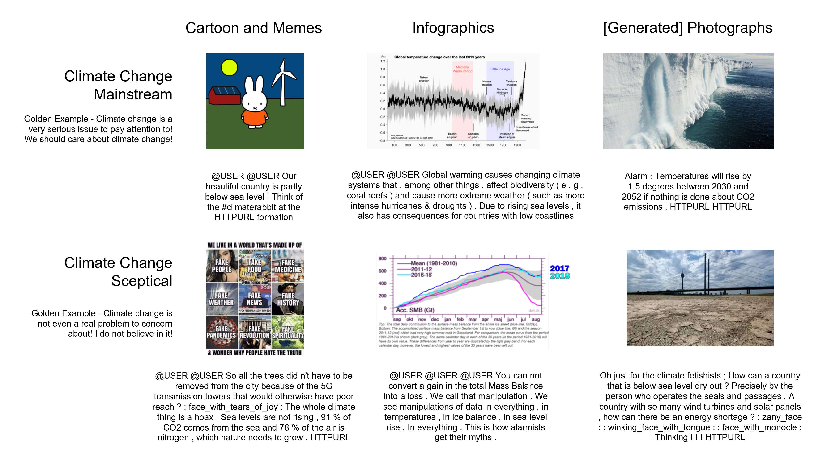

# Climate_Stance_Multimodal
This is the code for the Paper '*Inferring Climate Change Stances from Multimodal Tweets*' accepted by the Short Paper track of [SIGIR 2024](https://sigir-2024.github.io/index.html).

## Cite as

Nan Bai, Ricardo da Silva Torres, Anna Fensel, Tamara Metze, and Art Dewulf. 2024. Inferring Climate Change Stances from Multimodal Tweets. In Proceedings of ACM SIGIR ’24. ACM, New York, NY, USA, 5 pages.

## Workflow and Dataset
This project provides a workflow to construct multimodal dataset about climate change stances from Twitter.
The workflow is illustrated as follows:


The datasets used in the paper is saved under ```./Data``` folder.

For data security and privacy issues, we only share the processed, anonymized, and translated English tweets as the raw textual data and the image IDs as the visual data.
Further in-detail data can be provided upon request.

```./Data/tweets_subset.csv``` is the main dataset used for training and evaluation, which is a non-redundant, unambiguous, and easy subset of the originally collected Dutch language full dataset.

A snapshot of a few examples in the datasets:




## Code

### Model Variants
Five CLIP-based embedding model variants are used in this paper, all implemented from the [Sentence Transformer library](https://www.sbert.net/docs/pretrained_models.html#image-text-models):

| Model Variant | Name in Paper | Name in Repo | Embedding Size |
| ------------- | ------------- | ------------- | ------------- |
| clip-ViT-B-32 | B-32 | CLIP | 512 |
| clip-ViT-B-16 | B-16 | CLIP16 | 512 |
| clip-ViT-L-14 | L-14 | CLIP14 | 768 |
| clip-ViT-B-32-multilingual-v1 | ML-EN | CLIP_ML_EN | 512 |
| clip-ViT-B-32-multilingual-v1 | ML-NL | CLIP_ML_NL | 512 |

The computed textual and visual embeddings by each type of base models of the input datasets can also be provided upon request.

### MLP Checkpoints
For each model variant, several 3-layer MLP models are trained on top as stance classifier and new embedding model.